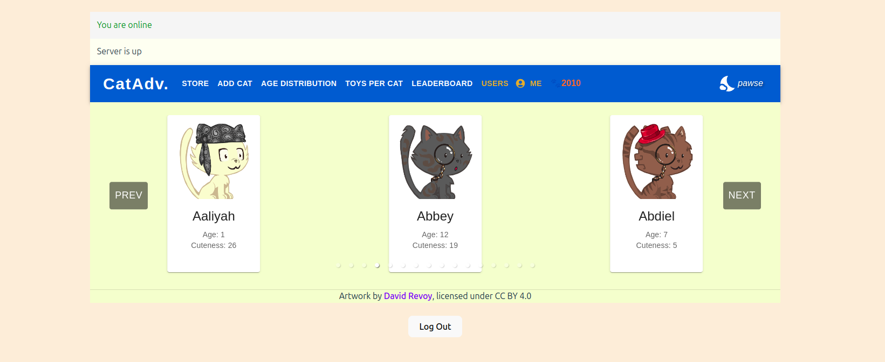
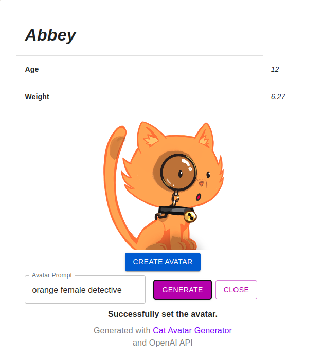
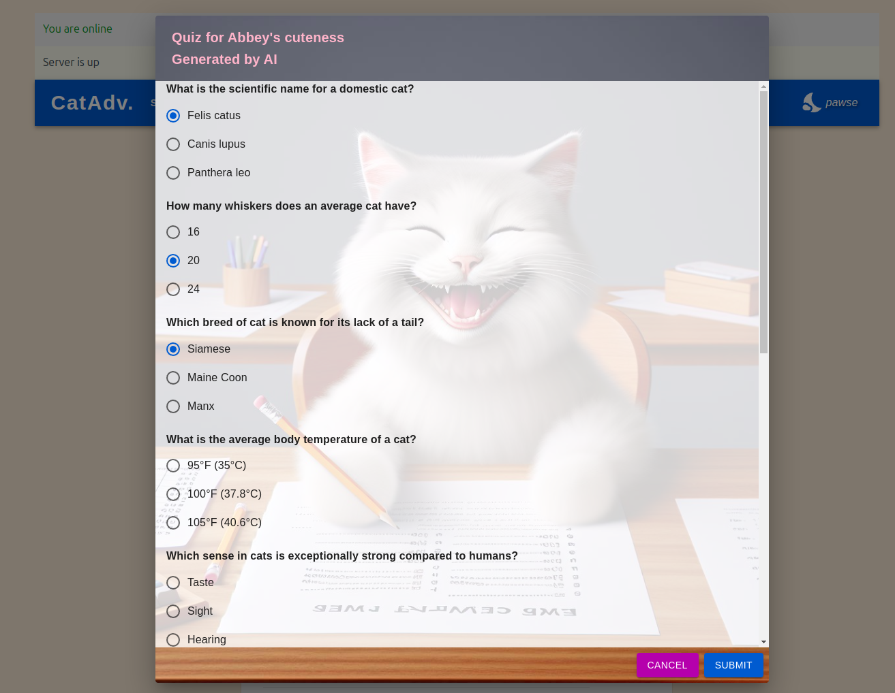
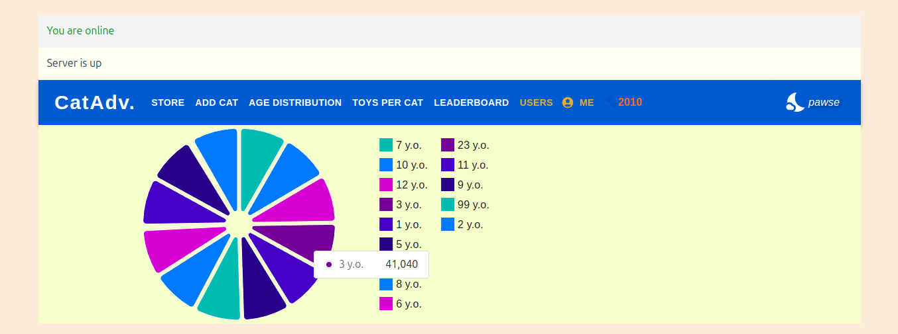
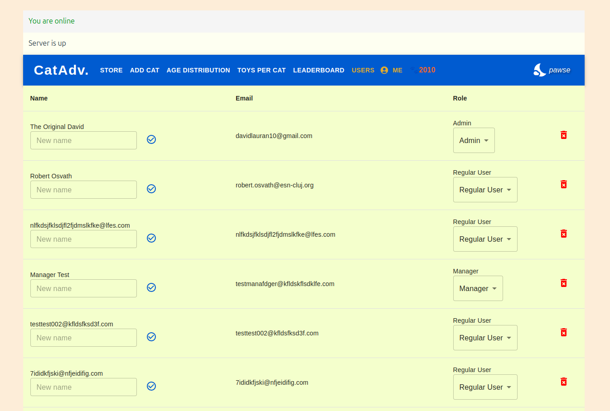

# CatAdventure - frontend
[Deployed here](www.google.com) \
[Backend repository here](https://github.com/LauranDvd/cat-adventure-backend)

*My cats*

This repository contains the frontend code for **CatAdventure**, an application where users can buy cats using in-game currency, enhance their "cuteness" by taking quizzes generated by the OpenAI API, generate custom 2D avatars, and other things. \
Written in **React**.

## Key Features
* cat & user management
* cat-themed quizzes
* 2D cat avatars generated based on the user's text input
* real-time charts via **WebSockets**
* authentication managed through Auth0
* infinite scrolling and offline support
* unit testing written with **Jest**, and E2E testing with **Cypress** 

## Screenshots

*Creating an avatar*

*Solving a quiz*

*Age distribution chart*

*User management, available to admins*